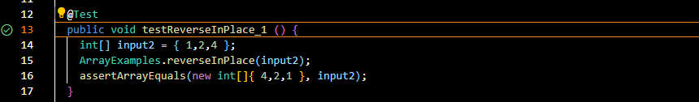

Part1:<pre><code>
	class SearchHandler implements URLHandler {
	ArrayList<String> strList = new ArrayList<String>();

	public String handleRequest(URI url) {
		if (url.getPath().equals("/add")) {
			String[] parameters = url.getQuery().split("=");
			if (parameters[0].equals("s")) {
				strList.add(parameters[1]);
				return String.format("String added!");
			}
		} else if (url.getPath().equals("/search")) {
			String[] parameters = url.getQuery().split("=");
			if (parameters[0].equals("s")) {
				String result = "";
				for (String s : strList) {
					if (s.contains(parameters[1])) {
						result += s + " ";
					}
				}
				return String.format("String serach is:%s", result);
			}
		}

		return "404 Not Found!";
	}</code></pre>
	

The Screenshot of the outcome of adding:Hello

The Screenshot of /add-messag: Hello

If you type the command "/add-message?s=Hello" with the outcome "Hello", the method handleRequest is called with an instance of the java.net.URI class as the argument. The argument url in the method call would represent the URI with a path of "/add-message" and a query of "s=Hello".

The relevant argument to the handleRequest method is url, which has a path of "/add-message" and a query of "s=Hello". The value of the strList field is an ArrayList of strings, which is initially empty.

Since the path of the URI is "/add-message", the method splits the query into key-value pairs and checks if the first element is "s". If so, it adds the second element, which is "Hello", to the strList ArrayList. This means that the value of the strList field changes from an empty ArrayList to an ArrayList containing one element, "Hello".

The method then returns the string "String added!" to indicate that the string "Hello" has been added to the ArrayList.

The Screenshot of /add-messag: How are you

If you type the command "/add-message?s=How are you" with the outcome "Hello How are you", the method handleRequest is called with an instance of the java.net.URI class as the argument. The argument url in the method call would represent the URI with a path of "/add-message" and a query of "s=How are you".

The relevant argument to the handleRequest method is url, which has a path of "/add-message" and a query of "s=How are you". The value of the strList field is an ArrayList of strings, which contains one element "Hello" from a previous request.

Since the path of the URI is "/add-message", the method splits the query into key-value pairs and checks if the first element is "s". If so, it adds the second element, which is "How are you", to the strList ArrayList. This means that the value of the strList field changes from an ArrayList containing one element "Hello" to an ArrayList containing two elements, "Hello" and "How are you".

The method then returns the string "String added!" to indicate that the string "How are you" has been added to the ArrayList.

Part2:

Intro: I'm going to introduce a bug from method testReverseInPlace. This method
should reverse the order of the elements in the array. For example, an array with a bunch of elements in 
order 1,2,3 would be reverse to 3,2,1

A failure-including input for the buggy program(testReverseInPlace):

  

An input that doesn't induce a failure:

<pre><code>
//input:
    static void reverseInPlace(int[] arr) {
      for(int i = 0; i < arr.length; i += 1) {
        arr[i] = arr[arr.length - i - 1];
      }
    }
//test:
	@Test 
	public void testReverseInPlace() {
    int[] input1 = { 3 };
    ArrayExamples.reverseInPlace(input1);
    assertArrayEquals(new int[]{ 3 }, input1);
	}
</code></pre>
Output: 

The symptom:

 <pre><code> @Test
  public void testReverseInPlace_1 () {
    int[] input2 = { 1,2,4 };
    ArrayExamples.reverseInPlace(input2);
    assertArrayEquals(new int[]{ 4,2,1 }, input2);
	}</code></pre>

The bug before fix:
<pre><code>
    static void reverseInPlace(int[] arr) {
      for(int i = 0; i < arr.length; i += 1) {
        arr[i] = arr[arr.length - i - 1];
      }
    }
</code></pre>

The code after bug fix:

<pre><code>
  static void reverseInPlace(int[] arr) {

      int SIZE = arr.length;
      int[] arr2 = new int[SIZE];
      for(int i = 0; i< SIZE;i++){
          arr2[i] = arr[i];
      }
      for(int i = 0; i < SIZE; i += 1) {
        arr[i] = arr2[SIZE - i -1];
    }
      arr[SIZE-1] = arr2[0];
  }
</code></pre>

<h2> Potential Issues I fixed in the Program </h2>
<h3> Issue 1: Short Reverse </h3>
The last element of the array will not change after the execution of the code in the case of a short reverse. This is due to the author's oversight in not appending the first index of elements in the original array to the current end of the array.

<h3> Issue 2: Long Reverse </h3>
In the case of a long reverse, the elements in the latter half of the array will re-reverse the order after the execution of the code. This is because the array is too long and thus re-reverses itself in the middle.

For instance, the array {9,0,0,4,3,8,3,4,0,0,9} would result from {1,2,4,6,7,8,3,4,0,0,9}.

<h3> Solution </h3>
To resolve both of these bugs, a deep copy of the array named 'NewArray' can be created using a for loop. The order of the array can then be reversed according to 'NewArray' using another for loop. This will ensure that all elements are copied and the order of the array is successfully reversed.

<h2> Week 3 Lab: Debugging with JUnit </h2>
In the lab of week3, I learned a lot especially I learned how to use the Junit to proper debug my code. Before the week3, I only know how to use Junit to find out the location of the bug. Now, I've already understand how to use the Junit to proper check each part of my code that could highly improve my efficiency on debugging like dividing the test code into sub-cases and checking.
