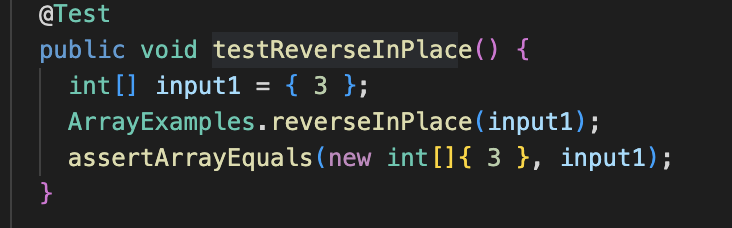

Part2:

Intro: I'm going to introduce a bug from method testReverseInPlace. This method
should reverse the order of the elements in the array. For example, an array with a bunch of elements in 
order 1,2,3 would be reverse to 3,2,1

A failure-including input for the buggy program(testReverseInPlace):

An input that doesn't indce a failure:

The symptom:

The bug before fix:

The bug after fix:

Before I describe why the fix could address the issue,
I would like to talk about what is the bug of the reverse method:

there're two potential problems of the program that might cause the bug:
1. For the case of short reverse, after the executation of the coding, the element of last index would not change.
This bug appears because author forget to append the first index of elements in original array to the current end of the array.
2. For the case of long reverse, after the executation of the coding, the elemets in the later half of array would
re-reverse the order.
This bug appears because the array is long that the array would re-reverse it self at the middle of the array.
For example the array{9	0	0	4	3	8	3	4	0	0	9} would be the result of {1,2,4,6,7,8,3,4,0,0,9}.

So, Here is a way to fix both of bugs together:
Creating a deep copy of the array named 'NewArray' by using the for loop. And the reverse the order of the array according to the 'NewArray' by using the
for loop. In this way, all of the elements would be copyed and the order of the array would be successfully reversed.

Part 3:
In the lab of week3, I learned a lot especially I learned how to use the Junit to proper debug my code.
Before the week3, I only know how to use Junit to find out the location of the bug. Now, I've already understand how to use the Junit to proper check each
part of my code that could highly improve my efficiency on debuging like dividing the test code in to sub-cases and check.
